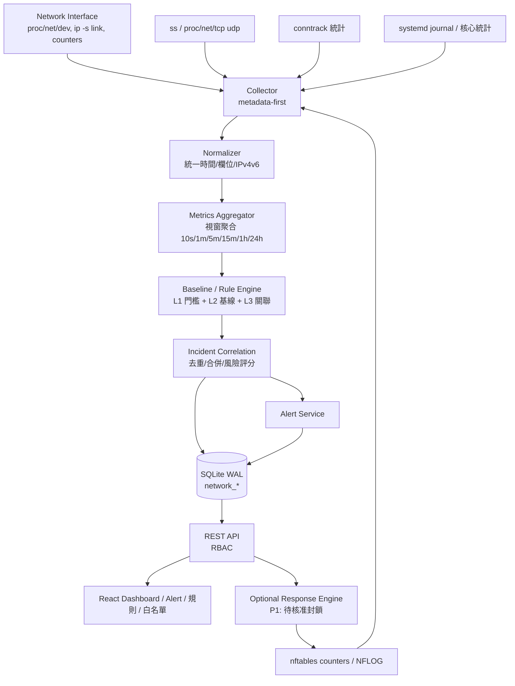
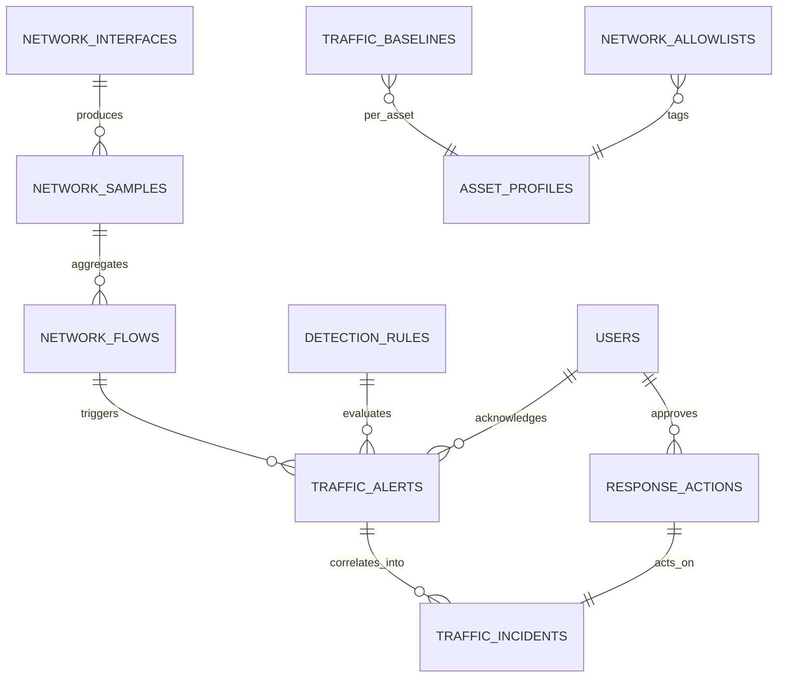
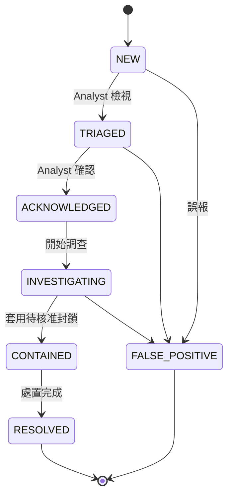

# SeMon 異常流量偵測總設計（Anomalous Traffic Detection Master Design）

## 1. 文件控制資訊

| 欄位 | 內容 |
|---|---|
| 文件名稱 | SeMon 異常流量偵測總設計（Anomalous Traffic Detection Master Design） |
| 文件代碼 | `SECMON-ATD-MASTER-DESIGN` |
| 版本 | `1.1-draft` |
| 建立日期 | 2026-07-20（UTC） |
| 任務代碼 | `SECMON-P1-ANOMALOUS-TRAFFIC-DESIGN-0720` |
| 執行模型 | `ZAI GLM-5.2` |
| 專案 | `secmon-linux-security` |
| 適用分支 | `feature/secmon-p4-detection-operations`（設計文件落點；實作分支後續另立） |
| 受測 / 起始 HEAD | `953ec0944266a69a0eab7db10820f475410ca50a`（Start HEAD，本文件建立時的 working tree HEAD） |
| 文件狀態 | `Draft`（待 Review；非 Approved） |
| 適用範圍 | SeMon 異常流量偵測 P1 設計階段（設計、規格、分階段規劃、測試計畫） |
| 不適用範圍 | Runtime 驗證、Release Gate、正式上線聲明（本文件不得宣告之） |

### 變更紀錄

| 版本 | 日期 | 變更摘要 | 作者 |
|---|---|---|---|
| 1.0-draft | 2026-07-20 | 首版總設計：涵蓋威脅模型、三層偵測、資料模型、API、前台、分階段實作（P1-A~P1-E）、測試與驗收門檻 | ZAI GLM-5.2 |
| 1.1-draft | 2026-07-20 | 獨立設計審查後修正：階段命名澄清（`P1-*`=`ATD-*`）、監控盲區總聲明、API 前綴/RBAC/分頁/錯誤格式對齊既有後端、資料模型 8 點對齊注意、特權模型對齊（複用 `NftablesService`）。未變更原始設計語意。 | ZAI GLM-5.2（Review） |

> 本文件為設計階段產出。所有 Runtime 結果、Release Gate、正式上線狀態以獨立驗收報告為準，本文件**不**宣告任何尚未執行的測試已通過。

### 階段命名注意（避免與專案里程碑混淆）

> **本文件中的 `P1-A`~`P1-E` 僅代表「異常流量偵測子系統（ATD）」的內部分期，不等同於 `secmon-linux-security` 專案整體的 P1 里程碑。** 為避免與專案既有 P1/P2/P3/P4/P5 里程碑混淆，實作與審查文件一律以 `ATD-A`~`ATD-E` 為主代號，並以 `P1-A`~`P1-E` 作為本文件內部的別名（兩者一對一對應：`P1-A=ATD-A`，依此類推）。後續審查報告與實作計畫採用 `ATD-*` 命名。

### 監控盲區總聲明（最高優先）

> SeMon ATD 部署於公司內網 Arch Linux **端點**（非 Gateway / Router / SPAN / TAP / NetFlow / Zeek 探針）。在此部署形態下，**SeMon 端點只能觀察「進出本機網卡的流量」，無法觀察同網段其他主機之間的東西向流量、其他主機的南北向流量、NAT/VPN/容器 overlay 內部流量**。本文件所有偵測能力均以此端點視角為前提；任何「全公司流量可見」的暗示均屬錯誤。需補足盲區須升級為 SPAN/TAP/NetFlow/Zeek，此類升級**不屬於 ATD 範圍**。

---

## 2. 執行摘要

### 2.1 為何需要異常流量偵測

SeMon 現有 P0~P4 已建立以**日誌事件**為核心的偵測鏈（SSH Journal、Nginx Access Log、Suricata `eve.json`、CrowdSec Alerts），並透過 Threat Engine、Alerts、Blocker、nftables 與 React 前台完成事件→告警→封鎖的閉環。然而日誌導向的偵測有以下盲區：

- 只能看見「被解析器理解的事件」，無法看見**未產生日誌的流量**（例如未命中規則的掃描、加密流量、被丟棄的封包）。
- 看不到**流量體積異常**（備份失控、資料外洩、放大攻擊）。
- 看不到**連線行為異常**（連線數暴增、SYN/ACK 失衡、橫向掃描）。
- 事件時間軸依賴應用層日誌，缺乏網路層的客觀佐證。

異常流量偵測模組（Anomalous Traffic Detection, ATD）的目的，就是在既有日誌事件之外，補上一條**以網路計量為基礎**的偵測縱深，讓 SeMon 能回答「**哪個 IP、從哪到哪、用什麼協定與埠、從何時開始、持續多久、與平常差多少、為何被判定異常、建議如何處理**」。

### 2.2 Arch Linux 內網主機能觀察到的流量

當 SeMon 部署於公司內網的 Arch Linux 端點（非 Gateway / Router / SPAN / TAP）時，主機可直接觀察：

- **本機收發的流量**：進出本機網卡的所有封包（`/proc/net/dev`、`ip -s link`、介面計數器）。
- **本機 socket 狀態**：`ss`、`/proc/net/tcp(6)`、`/proc/net/udp(6)`、conntrack 表與統計。
- **本機防火牆計數與日誌**：nftables counters、NFLOG、`journal`。
- **本機服務日誌**：systemd journal、應用日誌（間接反映流量）。

### 2.3 監控盲區（必須明確告知）

當主機**不是** Gateway / Router / SPAN Port / TAP 時，下列流量**無法**直接觀察，僅能在流量經過本機或命中本機服務時才可見：

- **同網段其他主機之間的東西向流量**（L2 直傳，不經過本機）。
- **其他內網主機對外的南北向流量**（除非本機是閘道）。
- **NAT 後方主機的真實來源**（只能看到 NAT 後的 IP）。
- **VPN / 容器 overlay / 虛擬網路** 內部流量（除非本機位於該 overlay）。
- **被交換器 ASIC 直接轉發而不複製到本機埠**的流量。

本設計的立場：**SeMon 以「端點視角」為主**，對這些盲區採取誠實標註，並在 §3 明確區分可觀測與不可觀測範圍；對於必須觀測的東西向流量，於 §6 提供 SPAN / TAP / netflow / Zeek 等可選升級路徑，但這些**不屬於 P1 範圍**。

### 2.4 核心原則：先觀測、再告警、最後才允許阻擋

P1 採三段式保守策略，對應 §19 的 P1-A~P1-E：

1. **先觀測**（P1-A）：建立可信的網路計量基礎，不告警、不阻擋。
2. **再告警**（P1-B / P1-C）：固定門檻 + 動態基線產生可解釋告警，僅建議處置。
3. **最後才允許阻擋**（P1-E）：只允許「待核准封鎖」，由 Admin 手動確認後才落地 nftables，且具備 Rollback。

P1 **禁止**未經核准直接封鎖任何公司內網 IP。

---

## 3. 問題定義與範圍

### 3.1 流量分類（依可觀測性分層）

| 分類 | 定義 | SeMon 端點可觀測？ | P1 處理 |
|---|---|---|---|
| 本機流量（Local） | 來源或目的地為本機的流量 | ✅ 完全可觀測 | P1 核心 |
| 經本機轉送流量（Forwarded） | 本機作為 Router/Gateway 時轉發的流量 | ⚠️ 僅當本機啟用轉發 | P1 探測並標註，非預設情境 |
| 同網段東西向（Lateral L2） | 同 subnet 內兩台其他主機互連 | ❌ 無法直接觀測 | P1 不處理，標註為盲區 |
| 對外南北向（North-South） | 本機 ↔ 外部網路 | ✅ 本機側可觀測 | P1 核心 |
| NAT 後方流量 | NAT 隱藏的真實來源 | ⚠️ 僅看到 NAT 後 IP | P1 記錄 NAT IP 並標註 |
| Proxy / VPN / 容器 / 虛擬網路 | overlay 或代理隧道內流量 | ⚠️ 視部署而定 | P1 觀測實體介面；overlay 列為可選 |
| 無法由端點觀察 | 不經本機的任意流量 | ❌ | P1 不處理，需 SPAN/TAP/netflow |

### 3.2 P1 範圍（In Scope）

- 本機網卡計量（BPS / PPS / 介面計數器）。
- 本機 socket 與 conntract 統計（連線數、新連線率、協定分布）。
- nftables counters 與 NFLOG（丟棄、接受的計量與取樣日誌）。
- 固定門檻 + 動態基線 + 事件關聯三層偵測。
- 告警與事件生命週期、白名單與誤報控制。
- REST API、前台 Dashboard、規則 / 白名單管理。
- 待核准封鎖（P1-E，含 Rollback）。

### 3.3 P1 範圍外（Out of Scope）

- 全封包 Payload 長期保存（P1 採 metadata-first）。
- SPAN / TAP / netflow / Zeek / Suricata 深度整合（列為可選來源，§6）。
- 自動封鎖（P1 僅允許待核准封鎖）。
- 跨主機集中式流量分析（屬後續多 Agent 演進）。

---

## 4. 威脅模型

下表為 P1 必須能辨識或至少產生可解釋訊號的威脅情境。每項列出：可觀測訊號、主要指標、判斷方式、可能誤報、建議處置。

> 「主要指標」對應 §7 核心指標代號；「判斷方式」對應 §8 偵測層（L1 固定門檻 / L2 動態基線 / L3 事件關聯）。

### 4.1 SYN Flood

| 項目 | 內容 |
|---|---|
| 可觀測訊號 | SYN 封包率激增、對單一目的埠集中、新連線暴增、ACK 回應稀少 |
| 主要指標 | `syn_pps`、`syn_ack_ratio`、`new_conn_per_sec`、單一 dst_port 集中度 |
| 判斷方式 | L1：`syn_pps` 超過安全上限；L3：流量暴增 + SYN 比率異常 + 新連線暴增 + 單一目的埠集中 |
| 可能誤報 | 大量短連線的合法服務（CI runner、健康檢查風暴）、keepalive 關閉的用戶端 |
| 建議處置 | 告警 High；建立待核准封鎖；檢查目的服務是否為本機對外服務 |

### 4.2 TCP Connection Flood

| 項目 | 內容 |
|---|---|
| 可觀測訊號 | 活躍連線數激增、新連線率激增、單一來源佔用大量 ESTABLISHED |
| 主要指標 | `active_conn`、`new_conn_per_sec`、per-src-IP conn |
| 判斷方式 | L1：單一 src 的 ESTABLISHED 數超過上限；L2：較同時段基線偏離 |
| 可能誤報 | 反向代理、Load Balancer、壓力測試、HTTP/2 多工 |
| 建議處置 | 告警 Medium~High；先確認是否來自已登記的反代 / LB |

### 4.3 UDP Flood

| 項目 | 內容 |
|---|---|
| 可觀測訊號 | UDP BPS/PPS 激增、對大量 dst_port 或單一埠集中 |
| 主要指標 | `udp_bps`、`udp_pps`、UDP 占比、unique_dst_port |
| 判斷方式 | L1：UDP PPS 超過上限；L3：UDP 暴增 + dst_port 快速變化 |
| 可能誤報 | UDP-based 備份、QUIC 大量連線（HTTP/3）、串流 |
| 建議處置 | 告警 Medium~High；檢查是否為已知 UDP 服務 |

### 4.4 ICMP Flood

| 項目 | 內容 |
|---|---|
| 可觀測訊號 | ICMP PPS 激增、ICMP 占比異常升高 |
| 主要指標 | `icmp_pps`、ICMP 占比 |
| 判斷方式 | L1：ICMP PPS 超過上限；L2：偏離基線 |
| 可能誤報 | 網路監控工具（Smokeping、Zabbix）、MTU 探測 |
| 建議處置 | 告警 Low~Medium；先排除監控主機 |

### 4.5 Port Scan（含 Horizontal / Vertical）

| 項目 | 內容 |
|---|---|
| 可觀測訊號 | 單一來源短時間內對多個目的埠連線、連線失敗率高 |
| 主要指標 | `unique_dst_port`、`failed_conn_rate`、per-src unique dst_port |
| 判斷方式 | L1：視窗內單一 src 命中 dst_port 數超過上限（Horizontal：多埠同 IP；Vertical：多 IP 同埠） |
| 可能誤報 | 服務探索（mDNS、 Consul health check）、監控系統 |
| 建議處置 | 告警 Medium；建立待核准封鎖 |

### 4.6 大量 DNS 查詢

| 項目 | 內容 |
|---|---|
| 可觀測訊號 | 對 53 埠的 UDP 流量激增、單一來源 DNS QPS 異常 |
| 主要指標 | per-src dst_port=53 PPS、unique_dst_ip（外部 DNS） |
| 判斷方式 | L2：偏離 DNS 基線；L3：DNS 暴增 + 大量外部解析 |
| 可能誤報 | DNS prefetch、漏洞掃描的 DNS 解析階段、郵件伺服器 |
| 建議處置 | 告警 Medium；確認是否走公司 DNS |

### 4.7 大量失敗連線

| 項目 | 內容 |
|---|---|
| 可觀測訊號 | SYN 未建立、RST 比例升高、conntrack 失敗 |
| 主要指標 | `failed_conn_rate`、`syn_ack_ratio`、RST 計數 |
| 判斷方式 | L1：失敗率超過上限；L2：偏離基線 |
| 可能誤報 | 服務重啟、防火牆預設拒絕、用戶端逾時重試 |
| 建議處置 | 告警 Medium；關聯 SSH/Web 事件交叉驗證 |

### 4.8 內網橫向移動（Lateral Movement）

| 項目 | 內容 |
|---|---|
| 可觀測訊號 | 單一內網 IP 對大量內網 IP 連線、多個內網服務埠被觸碰 |
| 主要指標 | internal-to-internal 流量、per-src unique internal dst_ip |
| 判斷方式 | L1：視窗內單一 src 命中內網 dst_ip 數超過上限；L3：搭配失敗連線 |
| 可能誤報 | 自動化运维、批次部署、漏洞掃描器 |
| 建議處置 | 告警 High；優先調查 |
| 盲區提醒 | 本機非 Gateway 時，其他主機間的橫向流量不可見（§2.3） |

### 4.9 資料外洩或異常上傳

| 項目 | 內容 |
|---|---|
| 可觀測訊號 | 單一內網 IP 對外 BPS 持續偏高、outbound 位元組遠高於 inbound |
| 主要指標 | internal-to-external BPS、outbound/inbound 比、flow duration |
| 判斷方式 | L2：偏離資產個別基線；L3：長持續 + 高 outbound + 非白名單目的地 |
| 可能誤報 | 正常備份、同步、上傳、CI artifact 推送 |
| 建議處置 | 告警 Medium~High；比對白名單與已核准傳輸 |

### 4.10 單一來源大量下載

| 項目 | 內容 |
|---|---|
| 可觀測訊號 | 單一 src 的 inbound BPS 持續偏高 |
| 主要指標 | per-src inbound BPS、flow duration |
| 列斷方式 | L2：偏離資產基線 |
| 可能誤報 | 系統更新、映像檔下載、鏡像同步 |
| 建議處置 | 告警 Low~Medium |

### 4.11 多來源對單一目的地集中連線（Distributed 對單點）

| 項目 | 內容 |
|---|---|
| 可觀測訊號 | 單一 dst 在短時間收到大量來自不同 src 的連線 |
| 主要指標 | per-dst unique_src_count、per-dst new_conn_per_sec |
| 列斷方式 | L1：per-dst unique src 超過上限；L3：搭配 SYN 比率 |
| 可能誤報 | 對公司對外服務的合法尖峰、CDN 回源 |
| 建議處置 | 告警 High；確認目的服務是否為本機對外服務 |

### 4.12 被入侵主機對外攻擊（Compromised Host Outbound Attack）

| 項目 | 內容 |
|---|---|
| 可觀測訊號 | 單一內網 IP 對大量外部 IP 連線、目的埠快速變化、失敗率高 |
| 主要指標 | per-src unique external dst_ip、unique_dst_port、failed_conn_rate |
| 判斷方式 | L3：單一內網 IP 對大量外部 IP + dst_port 快速變化 + 失敗率高 |
| 可能誤報 | 容器 registry pull、套件鏡像同步、CDN |
| 建議處置 | 告警 High~Critical；建立待核准封鎖；通報資產負責人 |

### 4.13 正常大型備份造成的誤報（反向情境）

| 項目 | 內容 |
|---|---|
| 可觀測訊號 | 備份伺服器 / NAS 對外或跨網段高 BPS、長持續 flow |
| 主要指標 | per-asset BPS、flow duration、是否命中白名單 |
| 列斷方式 | 不視為異常；命中白名單者套用較高門檻 / 獨立基線（§11） |
| 可能誤報 | — |
| 建議處置 | 告警 Info 或抑制；記錄備份時段供基線學習 |

---

## 5. 系統總體架構

### 5.1 完整資料流



### 5.2 元件責任與信任邊界

| 元件 | 責任 | 執行身份 | 信任邊界 |
|---|---|---|---|
| Collector | 讀取 P1 計量來源，metadata-first，不保存 Payload | 專用系統帳號（非 root），僅授予最小 capability | 不可寫入 nftables；不可直接存取 Web 秘密 |
| Normalizer | 統一時間（UTC ISO 8601）、IP（IPv4/IPv6 正規化）、欄位命名 | 與 Collector 同行程 | 不信任任何來源 IP 欄位，皆驗證格式 |
| Metrics Aggregator | 多視窗滾動聚合、Top-N、per IP/port 統計 | 與 Collector 同行程 | 聚合後資料不可逆推原始 Payload |
| Baseline / Rule Engine | 三層偵測；規則版本化；所有門檻可設定 | 與 Collector 同行程 | 規則載入需經 Audit |
| Incident Correlation | 去重、合併、風險評分、證據摘要 | 與 Collector 同行程 | 證據僅含 metadata |
| Database | SQLite WAL；事件 / 告警 / 基線 / 規則 | 與 Collector / API 共用檔案 | API 僅讀寫經授權範圍 |
| REST API | Dashboard / 告警 / 規則 / 白名單 / 回應動作 | 非 root；與 Collector 分離 | RBAC；封鎖類操作需 Admin |
| Response Engine | 僅 P1-E：執行「已核准」封鎖；dry-run 優先 | 受控 sudoers helper；非 Web 直接 root | 未核准動作一律拒絕 |

**信任邊界原則**：Collector（高權限讀取）與 Web API（對外暴露）必須在不同行程、不同帳號，秘密不共享；Response Engine 是唯一可觸碰 nftables 的元件，且只能執行資料庫中 `status='approved'` 的動作。

---

## 6. 流量資料蒐集來源

### 6.1 P1 必要來源

| 來源 | 可取得欄位 | root / capability | 效能成本 | 隱私風險 | 即時 / 事後 | P1 |
|---|---|---|---|---|---|---|
| `/proc/net/dev` | per-interface rx/tx bytes/packets/errors/drop | 無需 root | 極低 | 無 | 即時 | ✅ |
| `ip -s link` | 介面計數、狀態、queue | 無需 root | 低 | 無 | 即時 | ✅ |
| `ss -s` / `ss -tanu` | socket 摘要、ESTABLISHED 數、per IP/port | 無需 root（部分欄位需） | 低 | 中（IP/Port） | 即時 | ✅ |
| conntrack 統計 (`/proc/net/nf_conntrack`、`conntrack -S`) | flow 數、新 flow、失敗、per-tuple | 需 `CAP_NET_ADMIN` 或 root | 低 | 中 | 即時 | ✅ |
| nftables counters | per-rule / per-set 命中計數 | 需 `CAP_NET_ADMIN` 或受控 helper | 低 | 無（僅計數） | 即時 | ✅ |
| Linux interface counters (`/proc/net/snmp`, `/proc/net/netstat`) | TCP/UDP/ICMP 統計、SYN/ACK/RST、重傳 | 無需 root | 極低 | 無 | 即時 | ✅ |
| systemd journal | 介面事件、nftables 日誌、服務重啟 | `adm` group 或受控讀取 | 低 | 中 | 即時 + 事後 | ✅ |

**P1 預設採 metadata-first**：只蒐集計量與五元組 metadata，**不長期保存 Payload**。NFLOG 若啟用，僅取樣封包標頭並設定短保留期（§17）。

### 6.2 可選來源（非 P1；列為升級路徑）

| 來源 | 用途 | 成本 | 隱私 | 何時納入 |
|---|---|---|---|---|
| `tcpdump` / `tshark` | 事後調查、取樣標頭 | 中（CPU/磁碟） | 高 | 調查時手動；不入 P1 常駐 |
| `nethogs` / `iftop` | per-process / per-conn 即時 | 中 | 中 | 操作介面可選；不入 P1 常駐 |
| `vnstat` | 長期流量統計 | 低 | 低 | 可作為基線交叉驗證 |
| nftables log / NFLOG | 丟棄 / 接受的取樣日誌 | 中 | 中（標頭） | P1 可選啟用（取樣 + 短保留） |
| Suricata | L7 IDS 事件 | 高 | 高 | 已存在於 SeMon；ATD 消費其 metadata |
| Zeek | flow / DNS / TLS metadata | 高 | 中高 | 東西向觀測升級路徑 |
| eBPF / XDP | 高效能核心計量 | 高（開發成本） | 中 | 效能瓶頸出現時 |

### 6.3 升級路徑（東西向盲區）

當公司需要觀測 §3.1 中的「同網段東西向」時，應升級為以下之一，**不屬於 P1**：

- 在交換器設定 SPAN / RSPAN / Port Mirror，將流量送入 SeMon 主機。
- 部署獨立 TAP。
- 啟用交換器 netflow / IPFIX 匯出。
- 在閘道路徑上部署 Zeek。

---

## 7. 核心指標

所有指標皆為可設定、可查詢、可繪圖，並標註單位。命名以 `snake_case`，於資料庫與 API 一致。

### 7.1 體量類

| 指標 | 代號 | 單位 | 來源 |
|---|---|---|---|
| Bytes per second | `bps_total` | B/s | `/proc/net/dev` 差分 |
| Inbound bytes per second | `bps_in` | B/s | 同上 |
| Outbound bytes per second | `bps_out` | B/s | 同上 |
| Packets per second | `pps_total` | pkt/s | 同上 |
| Inbound / Outbound PPS | `pps_in` / `pps_out` | pkt/s | 同上 |
| Average packet size | `avg_pkt_size` | B | bps/pps |

### 7.2 協定類

| 指標 | 代號 | 單位 | 來源 |
|---|---|---|---|
| TCP / UDP / ICMP 占比 | `tcp_ratio` / `udp_ratio` / `icmp_ratio` | % | `/proc/net/snmp` |
| TCP SYN packets per second | `syn_pps` | pkt/s | netstat / NFLOG |
| SYN/ACK ratio | `syn_ack_ratio` | ratio | netstat |
| RST count | `rst_count` | pkt | netstat |
| 重傳率 | `retrans_ratio` | % | netstat |

### 7.3 連線類

| 指標 | 代號 | 單位 | 來源 |
|---|---|---|---|
| Active connection count | `active_conn` | count | `ss` / conntrack |
| New connections per second | `new_conn_per_sec` | conn/s | conntrack |
| Failed connection rate | `failed_conn_rate` | % | conntrack / RST |
| Flow duration | `flow_duration_avg` | s | conntrack |
| Per-src / Per-dst conn | `per_src_conn` / `per_dst_conn` | count | `ss` / conntrack |

### 7.4 分散度類

| 指標 | 代號 | 單位 |
|---|---|---|
| Unique destination IP count | `unique_dst_ip` | count |
| Unique destination port count | `unique_dst_port` | count |
| Unique source IP count | `unique_src_ip` | count |
| Per-src / Per-dst traffic | `per_src_bps` / `per_dst_bps` | B/s |
| Per-service-port traffic | `per_port_bps` | B/s |

### 7.5 流向類

| 指標 | 代號 | 說明 |
|---|---|---|
| Internal-to-internal | `i2i_bps` | 內網↔內網 |
| Internal-to-external | `i2e_bps` | 內網→外部 |
| External-to-internal | `e2i_bps` | 外部→內網 |
| Outbound/inbound ratio | `out_in_ratio` | 資料外洩偵測用 |

### 7.6 排行類（Top-N）

| 指標 | 代號 |
|---|---|
| Top Talkers | `top_talkers` |
| Top Destination | `top_destinations` |
| Top Port | `top_ports` |

> 內外網判定依 `config` 中的 CIDR 集合（`internal_cidrs`），預設涵蓋 RFC1918 與公司網段（**公司敏感網段不寫入 Git**，由環境注入，§17）。

---

## 8. 異常偵測策略（三層）

### 8.1 第一層：固定安全門檻（L1）

用於緊急、明確的異常。**所有數值必須可設定，不得寫死於程式碼**（存於 `detection_rules`，§12）。範例（僅為預設建議，落地前由 Admin 調整）：

| 規則代號 | 觸發條件（10s 視窗） | 預設建議 | 風險 |
|---|---|---|---|
| `L1_PPS_BURST` | `pps_total` > 門檻 | 50k pkt/s | High |
| `L1_CONN_CAP` | `active_conn` > 門檻 | 50k | High |
| `L1_SYN_RATIO` | `syn_ack_ratio` > 門檻 | 5.0 | High |
| `L1_PORT_SCAN_H` | per-src `unique_dst_port` > 門檻 | 50 / 10s | Medium |
| `L1_EGRESS_BURST` | 單一內網 IP `bps_out` > 門檻 | 500 Mbps | High |
| `L1_DST_FANIN` | per-dst `unique_src_ip` > 門檻 | 500 / 10s | High |

### 8.2 第二層：動態基線（L2）

候選方法（P1 採 **Median/MAD + 同時段百分位** 作為初期穩健基線）：

| 方法 | 特性 | P1 採用 |
|---|---|---|
| 移動平均 | 簡單，易被尖峰污染 | 評估用 |
| EWMA | 對近期敏感，仍受尖峰影響 | 評估用 |
| 標準差 | 對常態分佈敏感；網路流量常偏態 | 評估用 |
| **Median / MAD** | 穩健，抗離群值 | ✅ 初期主方法 |
| **百分位門檻（p95/p99）** | 直觀，與歷史同時段比較 | ✅ 初期主方法 |
| 同時段歷史基線 | 捕捉日週期 | ✅ |
| 工作日 / 非工作日基線 | 捕捉週週期 | ✅（P1-C） |

> 採 Median/MAD 與百分位的主因：網路流量具長尾與突發尖峰（備份、更新），平均/標準差會被少數尖峰污染而拉高門檻，導致真正異常被掩蓋。

L2 觸發：當現值偏離基線達可設定倍數（如 MAD 的 `k × MAD`，預設 `k=6`，或 p99 超出）。

### 8.3 第三層：事件關聯（L3）

以可解釋的布林/加權組合表達，輸出「疑似 ...」關聯事件：

```text
L3_RULE_SYN_FLOOD:
  流量暴增 (L1_PPS_BURST 或 L2 p99)
  AND SYN 比率異常 (L1_SYN_RATIO)
  AND 新連線暴增 (new_conn_per_sec 偏離基線)
  AND 單一目的埠集中 (per_dst_port 占比 > 門檻)
  => 疑似 SYN_FLOOD, risk=High

L3_RULE_COMPROMISED_EGRESS:
  單一內網 IP 對大量外部 IP (unique_dst_ip > 門檻)
  AND 目的埠快速變化 (unique_dst_port > 門檻)
  AND 連線失敗率高 (failed_conn_rate > 門檻)
  => 疑似 COMPROMISED_HOST, risk=High~Critical

L3_RULE_LATERAL_SCAN:
  單一內網 IP 對大量內網 IP (internal unique_dst_ip > 門檻)
  AND 多內網服務埠被觸碰
  => 疑似 LATERAL_MOVEMENT, risk=High
```

關聯規則亦存於 `detection_rules`，具版本號，變更須經 Audit。

---

## 9. 時間視窗

| 視窗 | 用途 | 告警角色 |
|---|---|---|
| 10s | 快速攻擊偵測（SYN/UDP/Scan 突發） | L1 即時告警 |
| 1m | 短期尖峰確認 | L1/L2 確認 |
| 5m | 持續異常判定 | L2 主要判定 |
| 15m | 事件關聯（L3） | L3 關聯視窗 |
| 1h | 趨勢與基線更新 | 基線學習 |
| 24h | 每日比較、日週期基線 | 基線學習 + 報表 |

**避免告警風暴**：

- **去重（dedup）**：相同 `(rule_id, src_ip, dst_ip, dst_port)` 在冷卻時間（如 5m）內只產生一筆 alert，更新 `evidence_summary` 與計數。
- **抑制（inhibit）**：若已存在更高風險的涵蓋性 alert，抑制子 alert。
- **分級視窗**：10s 視窗的告警必須在 1m 視窗被「持續」才升級為持續性告警；單點突發僅記錄為 `Info/Low`。
- **冷卻（cooldown）**：每規則每資源可設定冷卻時間，預設 5m。
- **告警速率上限**：單位時間總告警數上限，超過則進入「告警彙總」模式（聚合為一筆 Incident）。

---

## 10. 風險分數

### 10.1 可解釋評分模型（加權總和 + 分級映射）

| 維度 | 代號 | 權重建議 | 說明 |
|---|---|---|---|
| 流量偏差 | `w_bps_dev` | 1.0 | 與基線偏離程度（MAD 倍數） |
| PPS 偏差 | `w_pps_dev` | 1.0 | 同上 |
| 新連線數 | `w_new_conn` | 0.8 | 偏離基線倍數 |
| 掃描行為 | `w_scan` | 1.2 | unique dst_port/dst_ip |
| SYN/ACK 異常 | `w_syn` | 1.2 | ratio 偏離 |
| 內外網方向 | `w_direction` | 0.6 | e2i/i2e 權重不同 |
| 持續時間 | `w_duration` | 0.5 | 越長分數越高 |
| 白名單資產 | `w_allowlist` | −1.5 | **負權重**：降低風險但**不完全略過** |
| 重複發生 | `w_repeat` | 0.7 | 24h 內重複加分 |
| 重要伺服器 | `w_critical_asset` | 1.0 | 涉及標記為重要的資產加分 |

> 權重皆可設定（`detection_rules` 對應 `score_weights_json`）。`w_allowlist` 為負值體現「白名單降低風險但不豁免監控」（§11）。

### 10.2 分級

| 分級 | 分數區間（建議） | 前台顯示 | 告警方式 | 建議處置 |
|---|---|---|---|---|
| Info | 0~20 | 灰色 | 僅 Dashboard | 記錄、不通知 |
| Low | 21~40 | 藍色 | Dashboard + 日報 | 觀察 |
| Medium | 41~60 | 黃色 | Dashboard + 通知 | 分析師檢視 |
| High | 61~80 | 橙色 | Dashboard + 即時通知 | 調查 + 可建立待核准封鎖 |
| Critical | 81~100 | 紅色 | Dashboard + 即時通知 + 升級通報 | 立即調查 + 建立待核准封鎖 + 通報資產負責人 |

分數區間可設定；分級映射須經 Audit 變更。

---

## 11. 白名單與誤報控制

### 11.1 白名單資產類型（建議預設類別）

備份伺服器、NAS、系統更新伺服器、Proxy、DNS、DHCP、VPN、監控系統、容器 Registry、CI/CD Runner、管理者維護時段、已核准的大型檔案傳輸。

### 11.2 白名單行為（關鍵：不完全略過）

- 白名單**不**等於「免監控」。
- 命中白名單者：套用**獨立 / 較高門檻**與**獨立基線**（例如備份伺服器允許的 `bps_out` 上限為一般資產的 5 倍）。
- 評分時以負權重降低風險（§10 `w_allowlist`），但**仍記錄流量與事件**，供事後調查。
- 白名單項目須註明：負責人、用途、有效期間、允許的高門檻值。

### 11.3 誤報控制機制

- **資產個別基線**（P1-C）：為不同角色資產建立獨立基線。
- **時段基線**：工作日 / 非工作日 / 維護時段。
- **告警冷卻與去重**（§9）。
- ** Analyst 回饋迴圈**：`FALSE_POSITIVE` 告警可標註原因，回饋至門檻/基線調整建議（不自動改規則，需 Admin 核可）。

---

## 12. 資料模型

新增以下資料表，與既有 `attack_events` / `alerts` / `blocked_ips` / `audit_logs` / `users` / `ip_allowlist` 共存。所有 IP 欄位同時支援 IPv4 與 IPv6（以 TEXT 存正規化字串，並以 `ip_type` 標註 `ipv4`/`ipv6`）；時間一律 UTC ISO 8601。

### 與既有 schema 的對齊注意（經獨立審查，須於 ATD-A migration 落地前確認）

下列為 v1.0-draft 與既有 `DATABASE_DESIGN.md` / `database/migrations/001_initial.sql` 的**不一致點**，須於實作 migration 時統一（本階段未建立 migration）：

1. **時間戳預設值**：既有一律 `DEFAULT CURRENT_TIMESTAMP`（格式 `YYYY-MM-DD HH:MM:SS`）。本文件初版多處用 `strftime('%Y-%m-%dT%H:%M:%SZ','now')`，會在同一 DB 產生兩種字串格式，破壞字串範圍比較與前端解析。**應統一為 `CURRENT_TIMESTAMP`**。
2. **severity 型別**：既有為 `INTEGER CHECK (severity BETWEEN 1 AND 5)`（1 最嚴重）。本文件初版用 `TEXT ... IN ('info','low','medium','high','critical')`。若要與既有 `alerts`/`attack_events` 統一評分與排序，須擇一：改為 INTEGER 1~5，或建立雙向映射層並明確記錄。
3. **status 大小寫**：既有為小寫（`'new','acknowledged','investigating','resolved','ignored'`）。本文件初版用大寫（`'NEW',...`）。**應統一為小寫**。
4. **IPv4/IPv6 discriminator 欄位**：既有 schema 無此欄（v4/v6 由 Python `ipaddress` 處理）。本文件新增 `src_ip_type`/`dst_ip_type`/`cidr_type`/`ip_type`/`target_ip_type` 為**新增設計**，非沿用既有慣例；屬合理強化但須在 migration 說明。
5. **`retention_until` 欄位**：既有保留策略為「依表時間範圍刪除」，無 per-row retention 欄。本文件新增為**新增設計**。
6. **整數 FK 是否強制**：既有對 `users.id`、`attack_events.id` 等 `*_id` 欄多採 `REFERENCES ... ON DELETE SET NULL/CASCADE`；本文件初版將整數 FK 保留為邏輯關聯（無 `REFERENCES`）。實作時應對 `*_user_id`、`rule_id`、`incident_id` 補上 `REFERENCES ... ON DELETE SET NULL`，與既有慣例一致。
7. **migration 命名**：下一個可用編號為 `012`（既有：001,005,006,007,008,009,010,011）；檔名建議 `012_anomalous_traffic_detection.sql`。
8. **`block_source` enum**：既有為 `('manual','auto','crowdsec','suricata')`，**無 ATD 來源值**。ATD-E 落地封鎖時須擴充 enum（如新增 `'atd'`）或複用 `'auto'`，並以 migration 處理。

> 設計原則與既有 `DATABASE_DESIGN.md` 一致：WAL、`foreign_keys=ON`、`busy_timeout`、邏輯關聯（不強制 FK 於高頻寫入表）、小批次 transaction、保留期限欄位。

### 12.1 ER 概觀



### 12.2 `network_interfaces`

```sql
CREATE TABLE IF NOT EXISTS network_interfaces (
    id INTEGER PRIMARY KEY AUTOINCREMENT,
    name TEXT NOT NULL UNIQUE,                 -- ex: eth0, enp3s0
    ifindex INTEGER,
    iface_type TEXT,                           -- physical / virtual / loopback / tunnel
    is_internal INTEGER NOT NULL DEFAULT 1 CHECK (is_internal IN (0,1)),
    enabled INTEGER NOT NULL DEFAULT 1 CHECK (enabled IN (0,1)),
    created_at TEXT NOT NULL DEFAULT (strftime('%Y-%m-%dT%H:%M:%SZ','now')),
    updated_at TEXT NOT NULL DEFAULT (strftime('%Y-%m-%dT%H:%M:%SZ','now'))
);
```

### 12.3 `network_samples`（高頻寫入；保留期限短）

```sql
CREATE TABLE IF NOT EXISTS network_samples (
    id INTEGER PRIMARY KEY AUTOINCREMENT,
    sampled_at TEXT NOT NULL,                  -- UTC ISO 8601
    interface_id INTEGER NOT NULL,             -- FK network_interfaces.id (邏輯)
    sensor_host TEXT NOT NULL,
    bps_in REAL, bps_out REAL,
    pps_in REAL, pps_out REAL,
    tcp_ratio REAL, udp_ratio REAL, icmp_ratio REAL,
    syn_pps REAL, syn_ack_ratio REAL, rst_count INTEGER,
    active_conn INTEGER, new_conn_per_sec REAL, failed_conn_rate REAL,
    i2i_bps REAL, i2e_bps REAL, e2i_bps REAL,
    unique_dst_ip INTEGER, unique_dst_port INTEGER, unique_src_ip INTEGER,
    rule_version TEXT,                         -- 對應偵測規則版本快照
    retention_until TEXT NOT NULL              -- 保留期限；過期由清理任務刪除
);
CREATE INDEX IF NOT EXISTS idx_network_samples_time ON network_samples(sampled_at);
CREATE INDEX IF NOT EXISTS idx_network_samples_iface_time ON network_samples(interface_id, sampled_at);
```

### 12.4 `network_flows`（per 5-tuple 聚合；中期保留）

```sql
CREATE TABLE IF NOT EXISTS network_flows (
    id INTEGER PRIMARY KEY AUTOINCREMENT,
    window_start TEXT NOT NULL,
    window_end TEXT NOT NULL,
    sensor_host TEXT NOT NULL,
    interface_id INTEGER,
    src_ip TEXT NOT NULL,
    src_ip_type TEXT NOT NULL CHECK (src_ip_type IN ('ipv4','ipv6')),
    src_port INTEGER CHECK (src_port IS NULL OR src_port BETWEEN 0 AND 65535),
    dst_ip TEXT,
    dst_ip_type TEXT CHECK (dst_ip_type IN ('ipv4','ipv6')),
    dst_port INTEGER CHECK (dst_port IS NULL OR dst_port BETWEEN 0 AND 65535),
    protocol TEXT,                             -- tcp / udp / icmp
    direction TEXT,                            -- i2i / i2e / e2i / local
    bytes_total INTEGER, packets_total INTEGER,
    flow_duration REAL,
    conn_count INTEGER, failed_conn INTEGER,
    avg_pkt_size REAL,
    evidence_summary TEXT,                     -- JSON：指標快照與命中規則
    rule_version TEXT,
    risk_score INTEGER,
    retention_until TEXT NOT NULL
);
CREATE INDEX IF NOT EXISTS idx_flows_window ON network_flows(window_start, window_end);
CREATE INDEX IF NOT EXISTS idx_flows_src ON network_flows(src_ip, window_start);
CREATE INDEX IF NOT EXISTS idx_flows_dst ON network_flows(dst_ip, window_start);
```

### 12.5 `traffic_baselines`

```sql
CREATE TABLE IF NOT EXISTS traffic_baselines (
    id INTEGER PRIMARY KEY AUTOINCREMENT,
    asset_key TEXT NOT NULL,                   -- 'global' / 'asset:<ip>' / 'iface:<id>' / 'rule:<id>'
    metric TEXT NOT NULL,                      -- ex: bps_total / syn_pps ...
    window TEXT NOT NULL,                      -- 10s / 1m / 5m / 15m / 1h / 24h
    day_kind TEXT,                             -- weekday / weekend / maintenance
    hour_bucket INTEGER,                       -- 0~23（同時段基線）
    median_val REAL, mad REAL, p95 REAL, p99 REAL, mean REAL, std REAL,
    sample_count INTEGER,
    computed_at TEXT NOT NULL,
    UNIQUE(asset_key, metric, window, day_kind, hour_bucket)
);
```

### 12.6 `detection_rules`

```sql
CREATE TABLE IF NOT EXISTS detection_rules (
    id INTEGER PRIMARY KEY AUTOINCREMENT,
    rule_code TEXT NOT NULL UNIQUE,            -- ex: L1_PPS_BURST
    name TEXT NOT NULL,
    layer TEXT NOT NULL CHECK (layer IN ('L1','L2','L3')),
    rule_type TEXT NOT NULL,                   -- threshold / baseline / correlation
    condition_json TEXT NOT NULL,              -- 條件（可設定，不寫死）
    params_json TEXT,                          -- 門檻/倍數/視窗
    score_weights_json TEXT,                   -- 風險權重
    severity_default TEXT NOT NULL CHECK (severity_default IN ('info','low','medium','high','critical')),
    enabled INTEGER NOT NULL DEFAULT 1 CHECK (enabled IN (0,1)),
    rule_version TEXT NOT NULL,
    created_by INTEGER,                        -- FK users.id
    created_at TEXT NOT NULL DEFAULT (strftime('%Y-%m-%dT%H:%M:%SZ','now')),
    updated_at TEXT NOT NULL DEFAULT (strftime('%Y-%m-%dT%H:%M:%SZ','now'))
);
```

### 12.7 `traffic_alerts`

```sql
CREATE TABLE IF NOT EXISTS traffic_alerts (
    id INTEGER PRIMARY KEY AUTOINCREMENT,
    detected_at TEXT NOT NULL,
    rule_id INTEGER NOT NULL,                  -- FK detection_rules.id
    rule_version TEXT NOT NULL,
    sensor_host TEXT NOT NULL,
    src_ip TEXT, src_ip_type TEXT,
    dst_ip TEXT, dst_ip_type TEXT,
    dst_port INTEGER, protocol TEXT, direction TEXT,
    metric_snapshot TEXT NOT NULL,             -- JSON：觸發時指標快照（證據）
    baseline_ref TEXT,                         -- JSON：對應基線值（證據）
    risk_score INTEGER NOT NULL,
    severity TEXT NOT NULL CHECK (severity IN ('info','low','medium','high','critical')),
    status TEXT NOT NULL DEFAULT 'NEW' CHECK (status IN
        ('NEW','TRIAGED','ACKNOWLEDGED','INVESTIGATING','CONTAINED','RESOLVED','FALSE_POSITIVE')),
    dedup_key TEXT,                            -- 去重鍵
    cooldown_until TEXT,
    incident_id INTEGER,                       -- FK traffic_incidents.id
    acked_by INTEGER,                          -- FK users.id
    acked_at TEXT,
    evidence_summary TEXT,                     -- 人類可讀證據摘要
    suggestion TEXT,                           -- 建議處置
    retention_until TEXT NOT NULL
);
CREATE INDEX IF NOT EXISTS idx_alerts_status_time ON traffic_alerts(status, detected_at);
CREATE INDEX IF NOT EXISTS idx_alerts_src ON traffic_alerts(src_ip, detected_at);
CREATE INDEX IF NOT EXISTS idx_alerts_dedup ON traffic_alerts(dedup_key, detected_at);
```

### 12.8 `traffic_incidents`

```sql
CREATE TABLE IF NOT EXISTS traffic_incidents (
    id INTEGER PRIMARY KEY AUTOINCREMENT,
    created_at TEXT NOT NULL,
    incident_key TEXT NOT NULL UNIQUE,         -- 關聯合併鍵
    title TEXT NOT NULL,
    category TEXT NOT NULL,                    -- SYN_FLOOD / COMPROMISED_HOST / ...
    severity TEXT NOT NULL,
    status TEXT NOT NULL DEFAULT 'NEW' CHECK (status IN
        ('NEW','TRIAGED','ACKNOWLEDGED','INVESTIGATING','CONTAINED','RESOLVED','FALSE_POSITIVE')),
    scope_json TEXT,                           -- 涉及 IP/網段/資產摘要
    evidence_summary TEXT,
    correlation_rule_id INTEGER,
    correlation_meta TEXT,                     -- JSON：L3 關聯條件與命中 alert
    risk_score INTEGER,
    retention_until TEXT NOT NULL,
    updated_at TEXT NOT NULL DEFAULT (strftime('%Y-%m-%dT%H:%M:%SZ','now'))
);
```

### 12.9 `asset_profiles`

```sql
CREATE TABLE IF NOT EXISTS asset_profiles (
    id INTEGER PRIMARY KEY AUTOINCREMENT,
    ip TEXT NOT NULL,
    ip_type TEXT NOT NULL CHECK (ip_type IN ('ipv4','ipv6')),
    cidr TEXT,                                 -- 可指定網段資產
    hostname TEXT,
    role TEXT,                                 -- backup / nas / proxy / dns / ci / ...
    is_critical INTEGER NOT NULL DEFAULT 0 CHECK (is_critical IN (0,1)),
    owner TEXT,
    baseline_profile TEXT,                     -- 'global' / 'backup' / 自訂
    created_at TEXT NOT NULL DEFAULT (strftime('%Y-%m-%dT%H:%M:%SZ','now')),
    updated_at TEXT NOT NULL DEFAULT (strftime('%Y-%m-%dT%H:%M:%SZ','now')),
    UNIQUE(ip, cidr)
);
```

### 12.10 `network_allowlists`

```sql
CREATE TABLE IF NOT EXISTS network_allowlists (
    id INTEGER PRIMARY KEY AUTOINCREMENT,
    cidr TEXT NOT NULL,                        -- 含 IPv4/IPv6
    cidr_type TEXT NOT NULL CHECK (cidr_type IN ('ipv4','ipv6')),
    category TEXT,                             -- backup / nas / dns / proxy / maintenance ...
    reason TEXT,
    elevated_thresholds_json TEXT,             -- 獨立/較高門檻（不完全略過）
    maintenance_window_json TEXT,              -- 維護時段
    owner TEXT,
    expires_at TEXT,
    created_by INTEGER,
    created_at TEXT NOT NULL DEFAULT (strftime('%Y-%m-%dT%H:%M:%SZ','now'))
);
CREATE INDEX IF NOT EXISTS idx_allowlist_cidr ON network_allowlists(cidr);
```

### 12.11 `response_actions`（P1-E 待核准封鎖）

```sql
CREATE TABLE IF NOT EXISTS response_actions (
    id INTEGER PRIMARY KEY AUTOINCREMENT,
    incident_id INTEGER,
    action_type TEXT NOT NULL,                 -- block / unblock / ratelimit / quarantine
    target_ip TEXT NOT NULL,
    target_ip_type TEXT NOT NULL CHECK (target_ip_type IN ('ipv4','ipv6')),
    nft_rule_intent TEXT,                      -- 預計落地規則（dry-run 用）
    duration_sec INTEGER,                      -- 封鎖期限
    status TEXT NOT NULL DEFAULT 'PENDING_APPROVAL' CHECK (status IN
        ('PENDING_APPROVAL','APPROVED','EXECUTING','DONE','EXPIRED','ROLLED_BACK','REJECTED')),
    requested_by INTEGER,
    requested_at TEXT NOT NULL DEFAULT (strftime('%Y-%m-%dT%H:%M:%SZ','now')),
    approved_by INTEGER,
    approved_at TEXT,
    executed_at TEXT,
    expires_at TEXT,
    rollback_at TEXT,
    rollback_by INTEGER,
    audit_ref TEXT,                            -- 對應 audit_logs 代號
    evidence_summary TEXT
);
CREATE INDEX IF NOT EXISTS idx_response_status ON response_actions(status, requested_at);
```

### 12.12 保留期限與清理

| 表 | 預設保留 | 清理策略 |
|---|---|---|
| `network_samples` | 7~14 天（raw） | 每日清理 `retention_until` |
| `network_flows` | 30~90 天 | 每日清理 + 匯總進 `traffic_baselines` |
| `traffic_alerts` | 180 天 | 之後彙總為統計 |
| `traffic_incidents` | 1~2 年 | 含證據摘要，供稽核 |
| `response_actions` | 永久（稽核） | 不刪 |

清理任務由 Scheduler 執行，採小批次刪除以免鎖表。

---

## 13. REST API 設計

### 13.1 端點總覽

所有端點皆掛在既有 API 之下。**現有 SeMon API 一律使用 `/api/v1/...` 版本前綴**，因此本節所列 `/api/network/...` 應實作為 `/api/v1/network/...`（與既有 `/api/v1/events`、`/api/v1/firewall/blocks`、`/api/v1/alerts`、`/api/v1/allowlist`、`/api/v1/admin/audit` 一致）。下表「路徑」欄為簡寫，實作時一律冠上 `/api/v1`。

並依既有後端慣例調整（經獨立審查確認，詳見 `SECMON_ATD_INDEPENDENT_DESIGN_REVIEW_2026-07-20.md`）：

- **RBAC 角色名稱**：現有為小寫 `admin` / `analyst` / `viewer`（非本文件初版使用的 Admin/Analyst/Viewer 大寫）。
- **分頁格式**：現有回應為 `{"items":[...], "page":N, "page_size":N, "total":N}`（`page`/`page_size` 查詢參數，`MAX_PAGE_SIZE=200`），**非** `{data, meta, links}`。
- **錯誤格式**：現有為 `{"error":{"code","message","request_id"}}`（透過既有 exception handlers），**非** `{error:{code,message,details}}`。
- **Authentication**：JWT Bearer（HS256，預設 15 分鐘 TTL，server-side session 可撤銷）；無 API key、無 cookie。所有寫入端點首行須呼叫 `require_write_rate(request, user)`（每 user+client 60 mutations/min）。
- **稽核**：寫入端點須呼叫既有 `write_audit(...)`，`action` 為小寫動詞字串，敏感欄位自動 redact。

> 本節初版（v1.0-draft）使用的 `/api/network` 前綴、`{data,meta,links}` 分頁、`{error:{...,details}}` 錯誤格式、大寫角色名，為與現有後端不一致之處；於 ATD-A 實作前須以此處修正版為準。

| 方法 | 路徑 | 角色 | 說明 |
|---|---|---|---|
| GET | `/api/network/overview` | Viewer+ | 總流量、PPS、活躍連線、異常事件數、Critical/High 告警 |
| GET | `/api/network/interfaces` | Viewer+ | 介面清單與狀態 |
| GET | `/api/network/top-talkers` | Viewer+ | Top Source / Dst / Port |
| GET | `/api/network/traffic-series` | Viewer+ | 時間序列（視窗參數） |
| GET | `/api/network/alerts` | Viewer+ | 告警列表（篩選/分頁） |
| GET | `/api/network/alerts/{id}` | Viewer+ | 告警詳情含證據 |
| GET | `/api/network/incidents` | Viewer+ | 事件列表 |
| GET | `/api/network/incidents/{id}` | Viewer+ | 事件詳情 |
| GET | `/api/network/baselines` | Viewer+ | 基線查詢 |
| GET | `/api/network/rules` | Viewer+ | 規則列表 |
| POST | `/api/network/rules` | Admin | 新增規則（Audit） |
| PATCH | `/api/network/rules/{id}` | Admin | 修改規則（Audit；版本號遞增） |
| POST | `/api/network/alerts/{id}/acknowledge` | Analyst+ | 確認告警 |
| POST | `/api/network/alerts/{id}/close` | Analyst+ | 結案（含 FALSE_POSITIVE） |
| POST | `/api/network/incidents/{id}/response` | Admin | 建立「待核准封鎖」動作；**不自動封鎖** |

### 13.2 共用規範

- **RBAC**：沿用 `Admin / Analyst / Viewer`（§13.1 角色欄）。封鎖類（`/response`、規則變更）限 Admin；分析師可 ack/close；Viewer 唯讀。
- **查詢參數**：`start`、`end`（ISO 8601）、`window`（10s/1m/5m/15m/1h/24h）、`src_ip`、`dst_ip`、`port`、`protocol`、`severity`、`status`、`rule_id`、`q`（搜尋）。
- **分頁**：`limit`（預設 50，上限 500）、`offset`、回應含 `total`、`has_more`。
- **時間範圍**：所有時序端點強制 `start/end`，最長跨度由設定限制（避免全表掃描）。
- **回應格式**：統一 JSON `{ "data": ..., "meta": { "total":..., "window":..., "generated_at":... }, "links": {...} }`。
- **錯誤格式**：沿用既有 `{ "error": { "code": "...", "message": "...", "details": {...} } }`，HTTP 狀態碼符合語意（400/401/403/404/409/422/429/500）。
- **稽核**：所有狀態變更（ack/close/rule 變更/response）寫入 `audit_logs`，含使用者、時間、前後值。
- **防止一般使用者執行封鎖**：`/incidents/{id}/response` 與 rule 變更須 Admin；後端雙重檢查角色 + 資料庫 `response_actions.status` 必須為 `APPROVED` 才會被 Response Engine 執行。

### 13.3 範例回應（overview）

```json
{
  "data": {
    "bps_total": 12400000,
    "pps_total": 18000,
    "active_conn": 3120,
    "anomaly_count_24h": 7,
    "critical_high_alerts": 2,
    "direction": { "i2i": 0.32, "i2e": 0.45, "e2i": 0.23 },
    "protocol_ratio": { "tcp": 0.78, "udp": 0.18, "icmp": 0.01 }
  },
  "meta": { "generated_at": "2026-07-20T10:00:00Z", "window": "1m", "source": "secmon-atd" }
}
```

---

## 14. 前台 Dashboard 設計

### 14.1 Dashboard 區塊

| 區塊 | 內容 |
|---|---|
| KPI 列 | 總流量、Inbound/Outbound、PPS、活躍連線、異常事件數、Critical/High 告警 |
| 流向圖 | Internal↔Internal / Internal↔External / External↔Internal 比例 |
| 協定比例 | TCP/UDP/ICMP donut |
| 時間序列 | 流量 / PPS / 連線數（視窗切換） |
| Top Source IP / Top Dst IP / Top Port | Top-N 表 |
| 事件時間軸 | 告警與事件依時序 |
| 即時告警 | Critical/High 告警摘要 |

### 14.2 IP 詳細調查頁

單一 IP 點入後必須回答（§14.4 八問）：

- 該 IP 的流量趨勢、活躍連線、命中的規則、關聯告警/事件、是否白名單、資產角色、歷史是否重複、與基線差異。

### 14.3 管理頁

- 告警頁：狀態流（NEW→...→RESOLVED/FALSE_POSITIVE）。
- 偵測規則管理頁：啟停、編輯門檻（Admin）、版本檢視。
- 白名單管理頁：CIDR / 類別 / 維護時段 / 較高門檻 / 有效期。
- 回應動作頁：P1-E 待核准封鎖清單、核准/拒絕/到期/rollback。

### 14.4 前台必答八問（驗收重點）

> 前台**不得**只顯示「流量很大」，每筆告警/事件必須可呈現：

1. 哪一個 IP（src / dst，含 IPv4/IPv6 標示）。
2. 從哪裡到哪裡（direction + src→dst）。
3. 使用什麼協定及埠（protocol + port）。
4. 從何時開始（detected_at / window_start）。
5. 持續多久（duration）。
6. 與平常差異多少（vs baseline：倍數 / 百分位）。
7. 為何被判定為異常（命中規則代號 + L1/L2/L3 + metric_snapshot）。
8. 建議如何處理（suggestion + 是否建議建立待核准封鎖）。

---

## 15. 告警與事件生命週期

### 15.1 狀態機



### 15.2 去重 / 冷卻 / 合併

- **dedup_key**：`hash(rule_id, src_ip, dst_ip, dst_port, direction)`。
- **冷卻**：同 dedup_key 在 `cooldown`（預設 5m，可設定）內只更新既有 alert（計數 +1、`metric_snapshot` 取最新、`risk_score` 取最高）。
- **合併進 Incident**：L3 關聯命中時，將相關 alerts 合併為單一 `traffic_incidents`。
- **相同 IP 合併**：跨規則但同 src_ip 的多筆告警，於 15m 視窗內可彙整為一個 Incident（避免單一 IP 產生多告警）。

### 15.3 證據保存與稽核

- 每筆 alert 必含 `metric_snapshot`（觸發當下指標）與 `baseline_ref`（對應基線值）。
- Incident 含 `correlation_meta`（命中條件）。
- 所有狀態變更寫入 `audit_logs`（使用者、時間、前後狀態）。
- 證據僅含 metadata，不含 Payload。

---

## 16. 自動回應安全設計

### 16.1 P1 預設允許

- 告警（Alert）。
- 建議操作（suggestion）。
- 建立「待核准封鎖」動作（`response_actions.status=PENDING_APPROVAL`）。
- Admin 手動確認後才落地。

### 16.2 P1 嚴格禁止

- **禁止未經核准直接封鎖公司內網 IP**。
- Response Engine 只執行 `status='APPROVED'` 的動作；任何自動路徑不得直接將 `PENDING_APPROVAL` 升級為執行。
- Web API 不得直接呼叫 nftables；僅能寫入 `response_actions`。

### 16.3 後續可規劃（非 P1）

nftables temporary set、限速（ratelimit）、暫時隔離、封鎖期限、自動解除、Rollback、Admin 覆核、Emergency allowlist。

### 16.4 落地與 Rollback（ATD-E）

> **與既有特權模型對齊（經獨立審查）**：現有 SeMon 的 nftables 封鎖由 **API 行程（非 root `secmon` user）直接呼叫 `/usr/sbin/nft`** 達成，nft 權限屬**外部操作者責任**（systemd unit 未設 `AmbientCapabilities`、無 sudoers 授權 nft、`NoNewPrivileges=true`）。既有 `docs/SECMON_CODEX_PRIVILEGE_DESIGN.md` 的 sudoers 僅涵蓋**維護**（`backup-db`/`migrate-db`/`runtime-recovery`），**未授予任何 nft/firewall 權限**。因此本文件初版所述「受控 sudoers helper」「`CAP_NET_ADMIN`/`CAP_NET_RAW`」為**新增特權機制**，非沿用既有模式。ATD-E 落地前須擇一：
> - **(A) 沿用既有模式**：ATD 封鎖複用既有 `NftablesService`（`app.state.firewall`），不引入新 sudoers/CAP；封鎖權限由操作者既有的外部授權政策提供。
> - **(B) 新增受控 helper**：新增限定命令、固定參數、可稽核、可 rollback 的 helper 與 sudoers，並經獨立安全審查。
>
> **建議 ATD-A~D 採 (A)（零新特權），ATD-E 先以 dry-run + 待核准 + 複用既有 `NftablesService` 落地，(B) 留待後續評估。**

- 落地前先 **dry-run**：產生 `nft_rule_intent`，比對白名單與既有規則，不實際寫入。
- 落地使用 **temporary set** + `expires_at`；到期自動移除。
- 每次落地記錄 rollback 所需資訊（原 set 內容、規則代號）。
- Rollback 須由 Admin 觸發，記錄 `rollback_by/at`，並寫入 Audit。
- Emergency allowlist：可臨時將 IP 加入允許清單以覆蓋誤封，須 Admin 並設短時效。

---

## 17. 權限與隱私

| 項目 | 規範 |
|---|---|
| 最小權限 | Collector 僅需讀取計量；Response Engine 僅需受控 nftables 操作 |
| `CAP_NET_ADMIN` | 用於 conntrack 全表、nftables counters；優先以受控 sudoers helper 隔離，避免全程 root |
| `CAP_NET_RAW` | 用於 NFLOG/標頭取樣；不使用於 Payload 蒐集 |
| Collector / Web API 分離 | 不同帳號、不同行程、秘密不共享 |
| 非 root 執行 | Web API 與前台一律非 root；nftables 經 helper |
| Payload 不長期保存 | 預設 metadata-first；NFLOG 僅取樣標頭、短保留 |
| IP / 資產存取控制 | Viewer 僅看彙總；明細受 RBAC；敏感資產標 critical |
| API 稽核 | 所有狀態變更寫 `audit_logs` |
| 敏感設定不入 Git | `internal_cidrs`、公司網段、秘密以環境/設定檔注入，`.gitignore` 排除 |
| 日誌內容 | 不得含密碼、Token、API Key、完整機敏內容；輸出前 redaction |

---

## 18. 效能與容量規劃

| 項目 | P1 評估 |
|---|---|
| 採樣頻率 | 預設 1s（計量）、conntrack/socket 5s；可設定 |
| 每秒 Flow | 單機端點預估 < 5k flows/s；Aggregator 以滾動視窗消化 |
| SQLite 適用範圍 | 單機、單一 SeMon 主機、WAL、小批次寫入；適用 P1 |
| 切換 PostgreSQL 條件 | 多 Agent 集中、多人高併發、事件量 > 數千萬/日、跨主機關聯 |
| Raw samples 保留 | 7~14 天，之後僅留聚合 |
| Aggregation | 10s→1m→5m→15m→1h→24h 多層 roll-up |
| Downsampling | 歷史查詢自動選適當視窗（長跨度用粗視窗） |
| 資料清理 | 每日小批次刪除 `retention_until` 過期資料 |
| CPU/RAM/Disk | 預留配額；Collector 設 CPU/RAM 上限；磁碟設高水位告警 |
| 降級策略 | Collector 跟不上時：拉長採樣、停用 NFLOG、降低 Top-N 計算頻率、只保留 L1 門檻（停 L2/L3），並記錄 `degraded` 狀態 |

---

## 19. 分階段實作計畫

> 每階段列出：輸入、輸出、相依、測試、驗收、失敗回復。P1 嚴守「先觀測→再告警→最後才允許阻擋」。

### P1-A：可觀測性基礎

| 項目 | 內容 |
|---|---|
| 輸入 | `/proc/net/dev`、`ip -s link`、`ss`、conntrack、nftables counters、netstat |
| 輸出 | `network_interfaces`、`network_samples`、基本 API（overview/interfaces/top-talkers/traffic-series） |
| 相依 | 既有 SQLite schema、API 框架、RBAC |
| 測試 | 計量正確性、IPv4/IPv6、介面偵測、Schema migration fresh/repeat |
| 驗收 | Dashboard 能顯示即時 BPS/PPS/連線數與 Top Talkers；資料可查詢 |
| 失敗回復 | 停用 Collector、保留舊資料、回退 schema migration |

### P1-B：固定規則偵測（L1 + 告警生命週期）

| 項目 | 內容 |
|---|---|
| 輸入 | `network_samples` / `network_flows`、`detection_rules`（L1） |
| 輸出 | `traffic_alerts`（含證據）、alert API、生命週期狀態機 |
| 相依 | P1-A |
| 測試 | 門檻觸發、去重、冷卻、ack/close、RBAC、IPv4/IPv6 |
| 驗收 | 能對 SYN/PPS/連線/掃描/對外暴增產生可解釋告警 |
| 失敗回復 | 關閉特定規則（`enabled=0`）、降為 Info |

### P1-C：動態基線（L2）

| 項目 | 內容 |
|---|---|
| 輸入 | 歷史 samples/flows、`asset_profiles`、`network_allowlists` |
| 輸出 | `traffic_baselines`（Median/MAD、p95/p99、同時段、工作日/非工作日、per-asset） |
| 相依 | P1-A、P1-B |
| 測試 | 基線計算正確性、穩健性（尖峰不污染）、誤報調整、白名單獨立基線 |
| 驗收 | L2 告警附 `baseline_ref`；備份/更新不再誤報 |
| 失敗回復 | 暫時停用 L2，僅留 L1 |

### P1-D：前台整合

| 項目 | 內容 |
|---|---|
| 輸入 | P1-A~P1-C 的 API |
| 輸出 | Dashboard、告警頁、IP 調查頁（八問）、規則與白名單管理頁 |
| 相依 | P1-A~P1-C |
| 測試 | 圖表資料一致性、Playwright E2E、權限、分頁、時間範圍 |
| 驗收 | 前台能完整回答 §14.4 八問；Admin 可管理規則/白名單 |
| 失敗回復 | 前台降級為唯讀總覽 |

### P1-E：受控回應（待核准封鎖）

| 項目 | 內容 |
|---|---|
| 輸入 | `traffic_incidents`、Admin 核可 |
| 輸出 | `response_actions`、nftables temporary set（dry-run→approved→落地→到期/rollback） |
| 相依 | P1-A~P1-D、nftables helper、`audit_logs` |
| 測試 | nftables dry-run、白名單保護、到期解除、Rollback、稽核、權限（非 Admin 拒絕） |
| 驗收 | 可建立「待核准」動作；Admin 核可後正確落地；誤封可 rollback；全程稽核 |
| 失敗回復 | Rollback + Emergency allowlist；停用 Response Engine |

---

## 20. 測試計畫

### 20.1 測試類別

單元測試、API 測試、Migration（fresh / repeat）、SQLite integrity（WAL、foreign_keys）、權限測試、RBAC、告警去重、基線計算、IPv4/IPv6、高流量壓力測試、Collector 重啟、主機重新開機、服務失敗復原、nftables dry-run、Rollback、前台圖表資料一致性。

### 20.2 可重現測試情境（僅於授權隔離環境）

| 情境 | 工具/方式 | 期望 |
|---|---|---|
| 正常大型流量 | `iperf3` 對內 / 對外 | 不告警或 Info；若白名單則抑制 |
| 多連線壓力 | 多執行緒 socket | L1/L2 告警（依門檻） |
| TCP SYN 測試 | SYN 發送工具（隔離） | L1 SYN / L3 SYN_FLOOD |
| UDP 高流量 | `iperf3 -u` | L1 UDP / 暴增 |
| Port Scan | `nmap`（隔離、授權） | L1 PORT_SCAN_H / L3 |
| 正常 NAS 備份 | 模擬備份 + 白名單 | 不告警；記錄基線 |
| 白名單測試 | 白名單 IP 高流量 | 降低風險、較高門檻 |
| 事件去重測試 | 短時間重複觸發 | 合併為一筆 alert |

> **所有攻擊模擬只能在已授權的隔離測試環境執行。** 嚴禁對正式網段或未授權主機進行任何模擬。

### 20.3 警示

本文件**不**宣告任何上述測試已執行或已通過；測試結果以獨立驗收報告為準。

---

## 21. 驗收門檻（P1 設計階段）

### 21.1 設計驗收檢核

- [x] 主設計文件存在於 `docs/SECMON_ANOMALOUS_TRAFFIC_DETECTION_MASTER_DESIGN.md`。
- [x] Mermaid 圖可正常解析（§5 架構 flowchart、§12 ER 圖、§15 狀態圖）。
- [x] 架構、資料模型、API、UI、測試及安全控制完整。
- [x] 已明確說明內網端點的監控盲區（§2.3、§3.1、§4.8）。
- [x] 已定義 P1-A 至 P1-E（§19）。
- [x] 已定義固定門檻（§8.1）與動態基線（§8.2）。
- [x] 已處理白名單及誤報（§11）。
- [x] 已規劃 IPv6（§7、§12 IP 欄位）。
- [x] 已定義 Rollback（§16.4、§19 P1-E）。
- [x] 文件未宣告尚未執行的 Runtime 測試已通過。

### 21.2 正式狀態欄位

```text
P1_DESIGN_DOCUMENT_STATUS: COMPLETE
P1_ARCHITECTURE_STATUS: COMPLETE
P1_SECURITY_DESIGN_STATUS: COMPLETE
P1_IMPLEMENTATION_STATUS: NOT_STARTED
P1_RUNTIME_STATUS: NOT_TESTED
P1_QUALITY_GATE_STATUS: NOT_RUN
P1_RELEASE_GATE: FAIL
P1_FORMAL_ACCEPTANCE: PENDING
```

> 文件完成不等於 P1 Release Gate 通過。Implementation / Runtime / Quality Gate / Release Gate 仍須由實作與獨立驗收程序完成，本文件**不**代為宣告。

---

## 附錄 A：與既有 SeMon 模組對應

| ATD 概念 | 既有 SeMon 對應 | 整合方式 |
|---|---|---|
| `traffic_alerts` | `alerts` | 同生命週期模型；ATD 告警可與既有 alerts 並列於即時告警區 |
| `traffic_incidents` | （新增） | 可關聯既有 `attack_events` 形成跨層事件 |
| `response_actions` | `blocked_ips` | 待核准封鎖落地後寫入 `blocked_ips` 歷史 |
| `network_allowlists` | `ip_allowlist` | 沿用既有 CIDR 比對；新增 elevated thresholds |
| `audit_logs` | `audit_logs` | 所有狀態變更沿用 |
| RBAC | `users` 角色 | 沿用 Admin/Analyst/Viewer |

## 附錄 B：名詞

- **ATD**：Anomalous Traffic Detection，本設計之模組簡稱。
- **L1/L2/L3**：固定門檻 / 動態基線 / 事件關聯三層偵測。
- **metadata-first**：以計量與五元組 metadata 為主，不長期保存 Payload。
- **MAD**：Median Absolute Deviation，穩健離群值度量。
- **待核准封鎖**：`response_actions.status=PENDING_APPROVAL`，須 Admin 核可才落地。
